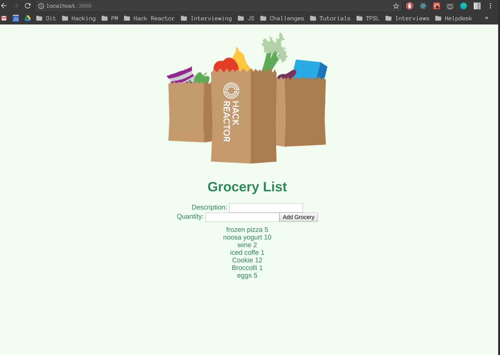

## HACK REACTOR REVIEW - GROCERY LIST

# The App

# Description
Grocery List displays a list of groceries and their quantity from an array upon initial load.
It allows users to add more groceries to the database and immediately displays new ones added.

# Debug Requirements - Each part of the app has an error you need to fill in or debug
1. Client-side: GET/POST REQUESTS WITH axios
2. Server-side: GET response
3. Database: Figure it out ;)

# Important Information

## Express.js
For this project you will not be using live server but instead a local server has been setup for you
using Express.js. You don't need to worry about the details of the express server at this point.

## Nodemon
You will also be using an npm package called nodemon which will watch files in your application directory
and restart your web server (Express.js) automagically. In order to run nodemon, follow step's #4 and #7 above in the instructions.

## Webpack
Instead of running a manual babel transpiler (with a watch command) you will instead use a package called Webpack.
Webpack has the ability to perform many functions but for this project it will simply watch and automatically transpile your jsx files
using the react and es2015 presets. It will take all of your transpiled files and combine them into a single filed called bundle.js
Your bundle.js is linked via your index.html. You will perform the steps needed to run Webpack by performing step #5 and step #6 above.

If you have errors in your react files and you don't see errors in your browser console window because there was
a problem transpiling the jsx files then you will see those errors in the terminal window where webpack is running.
